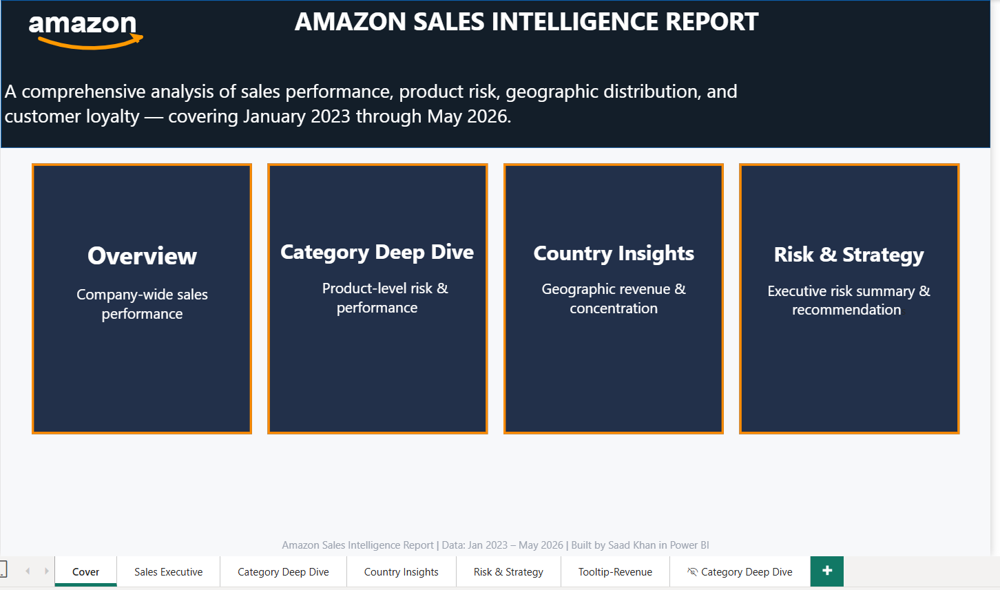

# Amazon Sales Intelligence Dashboard

An end-to-end, 4-page interactive Power BI report simulating an executive sales intelligence suite for an e-commerce brand (modeled on Amazon-style retail data). Built to surface not just *what's happening* in the business, but *why* — pairing every chart with the underlying risk or opportunity it reveals.

## 🔗 Quick Links
- [Download the .pbix](Amazon_Sales_Dashboard.pbix)

---

## 📊 The Business Problem

Most portfolio dashboards stop at "here are some charts." This project was built to go one step further: every page answers a specific business question, and every KPI is checked for real, data-grounded insight before being placed on the canvas — not just visualized for the sake of it.

**Dataset:** ~1,737 orders across 1,000 products, 1,287 customers, 20 countries, and 19,315 browsing sessions, spanning Jan 2023 – May 2026.

---

## 🏠 Page 1 — Sales Executive Overview

High-level company performance: revenue trend, category mix, geographic split, and category-level risk scoring — designed for a 30-second executive skim.

**Key insight surfaced:** 34% of total revenue is concentrated in a single country (the US) — a market diversification flag baked directly into the Strategic Insights panel, not buried in a footnote.

**Features:**
- KPI cards with MoM/YoY % deltas, dynamic arrow + conditional color (green/red) via DAX
- Area chart with a custom dark **tooltip page** showing MoM/YoY on hover
- Donut chart (revenue by category) + horizontal bar chart (revenue by country)
- Matrix with conditional-formatted **Stock Risk** flag (Low/Medium/High), driven by a 3-tier DAX bucket measure
- Sidebar navigation buttons wired via **bookmark/page-navigation actions**

---

## 🔍 Page 2 — Category & Product Deep Dive

Drills into *why* category-level performance looks the way it does — separating genuine stockout risk from dead inventory, which look identical at a glance but require opposite strategic responses.

**Key insight surfaced:** **57.3% of the entire product catalog has never sold a single unit.** Books is the worst offender (79% never sold) *despite* having the healthiest stock levels of any category — a product-curation problem, not a supply problem.

**Features:**
- Top 10 Products and Never-Sold/Slow-Moving Products tables (Top-N visual filters)
- % Never Sold by Category + Stock Risk by Category bar charts, each using a custom field-value color measure
- Price vs. Rating scatter plot (bubble size = revenue) for spotting pricing/quality mismatches
- **Layered bookmark toggle:** a Scatter Chart and a Strategic Insights panel occupy the exact same canvas space, swapped via two buttons bound to visibility-state bookmarks

---

## 🌍 Page 3 — Country Insights

Geographic concentration and market-quality analysis — moving past "which country sells most" into "which markets are actually worth investing in."

**Key insight surfaced:** It takes only **10 of 20 countries to reach 80% of revenue** (classic Pareto concentration), but the highest revenue-*per-customer* markets — South Korea, Denmark, France — aren't the biggest-volume ones. Small markets are quietly outspending the US on a per-customer basis.

**Features:**
- Filled map (geocoded via a dedicated `Country Name` calculated column, built specifically to avoid Power BI misreading 2-letter ISO codes like `CA`/`IN`/`DE` as US states)
- Pareto / revenue-concentration line chart with an 80% reference line
- Top 10 Countries bar chart with a custom 20-country field-value color palette
- Country performance table (Revenue, Customers, Revenue/Customer)

---

## ⚠️ Page 4 — Risk & Strategy

The executive summary page — synthesizes every risk found across the previous three pages into one scorecard, plus two new findings specific to this page: a broken loyalty program and a single-point conversion bottleneck.

**Key insights surfaced:**
- **Loyalty program inversion:** Platinum-tier customers spend *less* per customer ($96.6) than Bronze-tier customers ($99.9) — the loyalty program isn't rewarding the behavior it's designed to.
- **Conversion funnel:** 100% of sessions include at least one interaction (engagement isn't the problem) — but only 9% convert to an order. The entire funnel loss is concentrated at one decision point.

**Features:**
- Conversion funnel (Sessions → Interactions → Orders) built on a manually-constructed disconnected dimension table
- Repeat Purchase Rate gauge visual
- Revenue per Customer by Loyalty Tier column chart (visualizes the inversion directly)
- Risk scorecard mini-cards + full written strategic recommendations

---

## 🛠️ Technical Highlights

This project was built to demonstrate depth beyond basic chart-building:

| Technique | Where it's used |
|---|---|
| **DAX time intelligence** (`DATEADD`, running totals) | MoM/YoY measures, revenue trend |
| **Dynamic measure-driven titles** | Chart title swaps based on active slicer selection |
| **Field-value conditional formatting** | Stock risk colors, country colors, MoM/YoY arrow colors |
| **Bookmark-based visual layering** | Scatter chart ↔ Insights panel toggle on one canvas footprint |
| **Custom tooltip pages** | Dark-themed hover popup on the revenue trend chart |
| **Disconnected dimension tables** | Funnel stage ordering |
| **Field parameters** | Early-stage dynamic axis swapping (Date/Category/Country) |
| **Calculated columns for geocoding** | `Country Name` column to resolve ISO-code ambiguity on the map |
| **3-tier risk bucketing** | Stock Risk Level (Low/Medium/High) based on category-level averages, not flat thresholds |
| **Page navigation + sidebar UX** | Consistent filter panel and nav buttons across all 4 pages |

---

## 📁 Tools Used
- **Power BI Desktop** — report building, DAX modeling, data visualization
- **DAX** — 50+ custom measures across KPIs, trend analysis, risk scoring, and geographic analysis
- **Power Query / Data Modeling** — relationship design, calculated columns, date table setup

---

## 📂 How to Use
1. Clone or download this repository
2. Open `Amazon_Sales_Dashboard.pbix` in Power BI Desktop (free download from Microsoft)
3. Navigate the 4 pages via the sidebar buttons or page tabs at the bottom

*Note: this is a local .pbix file — there is no hosted live-service link. All screenshots above reflect the actual, functioning report.*

---

## 📬 Contact
Built by **Mohammad Saad Khan**
[LinkedIn](#) · [GitHub](#)
